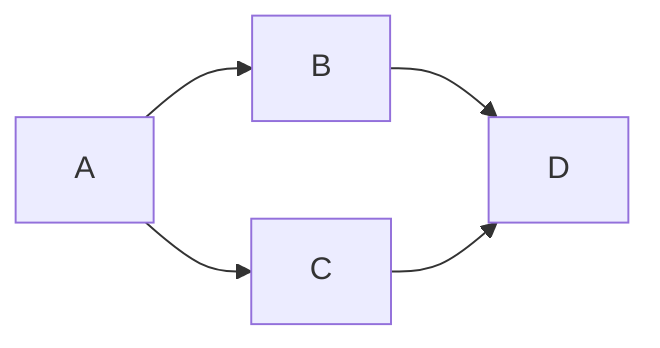
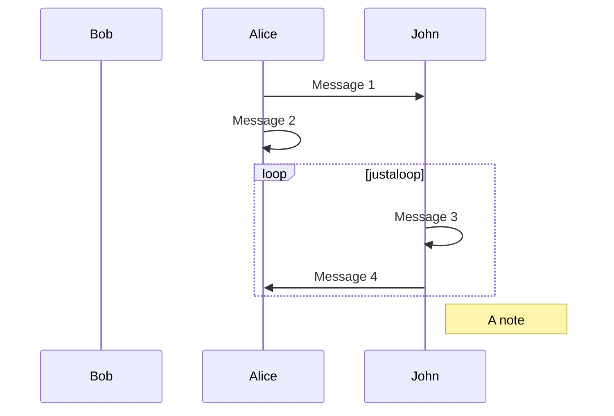
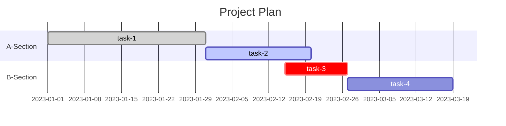
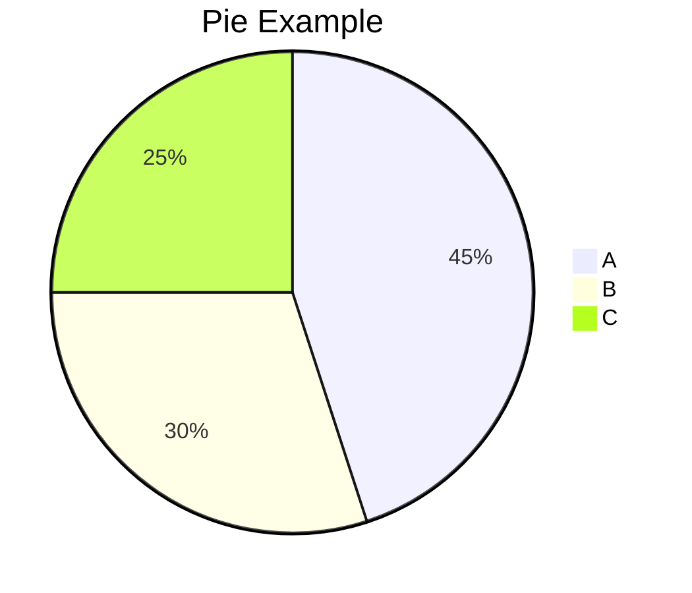
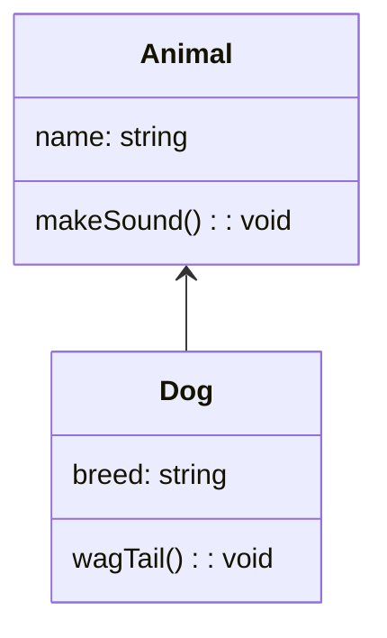
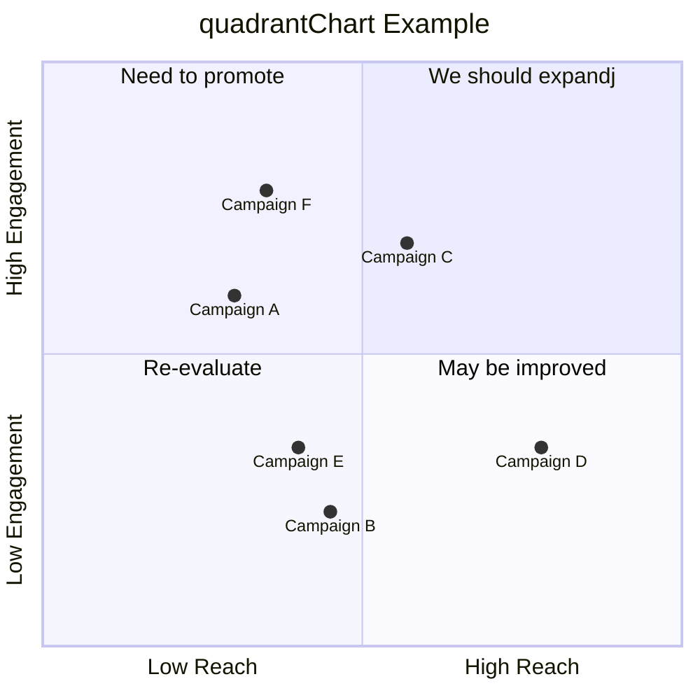
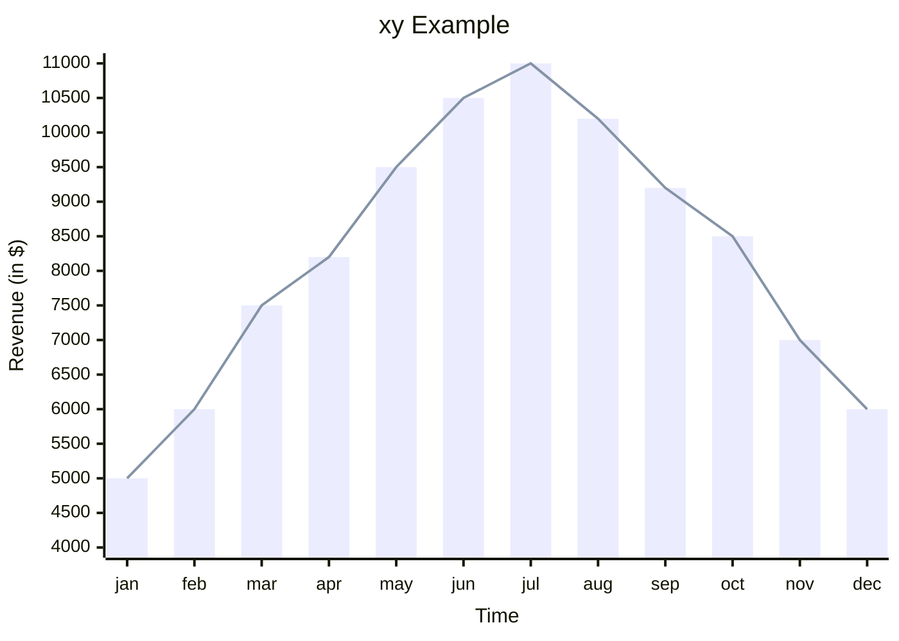

本文是对前文没有写到的一些Markdown的内容的补充，并谈一谈个人对Markdown的看法。

更多Markdown的基础语法可以查阅上一篇文章：
[Markdown入门指北](https://zhuanlan.zhihu.com/p/667641324)

# 补充内容

补充的内容主要是在Markdown中用Mermaid进行基本的绘图。

Mermaid是一种支持Markdown的图表生成工具，它允许你使用简单的文本语法创建流程图、时序图、甘特图等各种图表。以下是一些常见的Mermaid语法示例：

## 流程图

上面的例子创建了一个简单的流程图，节点A连接到B和C，而B和C都连接到D。

- 其中`graph TD`和`graph LR`分别表示竖向的图和横向的图。
- 两个元素之间用箭头符号`-->`连接。

## 时序图

这是一个简单的时序图，描述了Alice发送消息给John，并给自己发送消息，然后John在一个循环中给自己发送消息并回复消息的过程。

- `sequenceDiagram`用于指示图表的类型为时序图
- `participant`用于添加参与者，当参与者在后面代码中会出现时这句话没有必要
- 每次发消息的语法是`A->>B: Message`
- 可以用loop语句创建一个循环
- 可以用Note来创建一个注释，语法是`Note left/right of C`，C表示一个人名，意思是在C的左边或右边添加一个注释

## 甘特图

这是一个简单的甘特图，展示了两个项目（A和B）的任务计划和时长。

- `gantt`表示图表类型为甘特图
- `dateFormat`表示日期的显示格式
- `title`用于给这张图表起一个标题
- `section`表示项目进行的各个部分
- 项目中的每个任务用这样形式的语法来表示`任务名称:任务情况,任务称呼,任务开始时间,任务持续时间`，以下将逐个解释这些参量
- 任务名称：就是标在图中的任务名，不可省略
- 任务情况：`done`表示该任务已经完成，会被标成灰色；`active`表示该任务正在进行中，会被标成深蓝框，浅蓝底；`crit`表示紧急任务，会被标成红色；省略参数即默认，会被标成深蓝框蓝底
- 任务称呼：即在代码中引用该任务时用到的别称，可省略
- 任务开始时间：字面意思，有两种常见写法，一是用`dateFormat`的格式直接写时间，二是用`after 任务称呼`的格式表示紧随于某项任务之后
- 任务持续时间：字面意思，由`数字+单位`的格式表示。单位为一个字母：`s`表示秒；`m`表示分钟，`h`表示小时，`d`表示天

## 饼图

这个例子创建了一个简单的饼图，显示了三个部分（A、B、C）的比例。

- `pie`表示图表类型为饼图
- `title`用于给这张图表起一个标题
- 每个部分的格式为`"部分名称":比例`。此处的比例不一定需要是百分比。

## 类图

这是一个简单的类图，描述了一个Animal类和继承自Animal的Dog类。

- `classDiagram`表示图表类型是类图
- 用`class{...}`的语法来表示类中包含的内容
- 用`A<--B`来进行类与类之间连接来表示类的继承和从属关系。
- 连接的线条形式很多。可以用`--`表示实线，`..`表示虚线。可以用`<`或`>`表示普通箭头；`<|`或`|>`表示空心三角箭头；`*`表示实心箭头；`o`表示空心箭头。

## 象限图

这是一个象限图的例子，源码截取自mermaid官方文档（笔者懒得自己造了，体谅一下捏）

- `quadrantChart`表示图表的类型是象限图
- `title`用于给这张图表起一个标题
- `x-axis A --> B`表示x轴的负半轴是A，正半轴是B；y轴同理
- `quadrant-n`用于给每个象限一个内容
- `点的名称:[x坐标,y坐标]`用于作出每个点。注意：此处点的坐标取值范围为0到1，0.5为每个象限的分界处。

## XY图

这是一个XY图的例子，源码截取自mermaid官方文档

- `xychart-beta`表示图表的类型是XY图
- `title`用于给这张图表起一个标题
- `x-axis`和`y-axis`用来绘制xy轴，语法是`x/y-axis "名称" 数据`
- `bar`用于绘制柱状图，`line`用于绘制折线图。，语法是`bar/line 数据`
- 数据有两种表示方式：一是用`[数据1,数据2,...]`的方式枚举；二是用`数据1-->数据2`的方式，会自动填充中间的数字。

mermaid还有git图，实体关系图，旅程图等功能，可以查阅官方文档获取更多，官方文档链接在文末提供

# 看法

以下是作者本人关于Markdown的一些看法，个人观点，勿喷。

Markdown是一种轻量级语言，它的产生就是为了更方便记录和进行一些简单的排版。总而言之，它是为了方便而诞生。相对而言Markdown的难度不高，学习成本也比较低。

有时在知乎上刷到一些问题，说Markdown的排版能力差，说Markdown在不同编辑器上的结果不一样，说Markdown学习困难等。我觉得这些问题应当是选取的工具不当，而不应该是Markdown本身的问题。譬如追求更强的排版能力自然可以使用Word或LaTeX。而Markdown作为一个方便使用的轻量级标记语言，它在方便人们记录方面确实起到了很大的作用。

另外，个人认为Markdown的根本应当是记录，因此使用一些绚烂的模版其实并没有必要，这两篇文章中讲述的语法已经完全够用了

顺带提一句，知乎能直接用Markdown发表文章是真的很方便。

# 声明

- 本文参考mermaid官方文档。网址链接：
  [mermaid官方文档](https://mermaid.js.org/intro/)
- 转载请注明出处并放置相关链接
